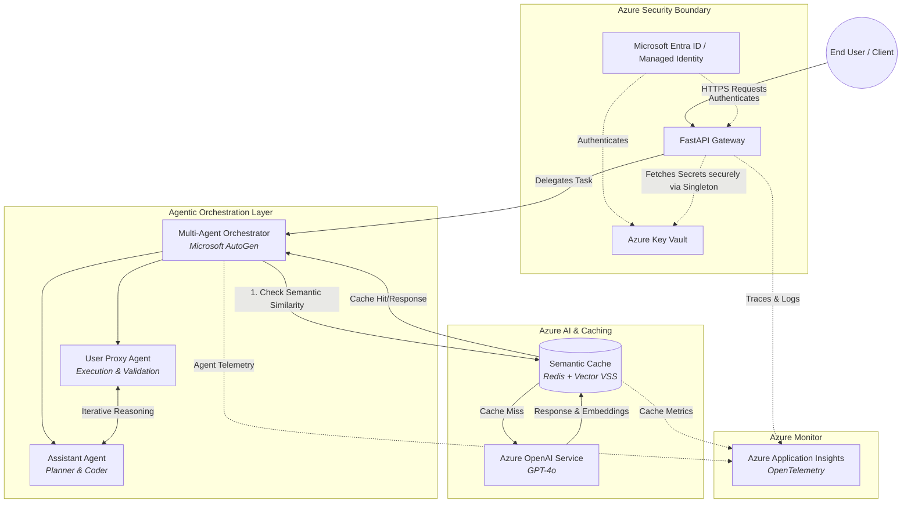

# Comprehensive Azure AI Agentic OS

## Overview

The **Comprehensive Azure AI Agentic OS** is an enterprise-grade, production-ready framework designed for orchestrating sophisticated, multi-agent Generative AI solutions within a secure Microsoft Azure environment. It acts as an intelligent operating system, abstracting infrastructure complexity while delivering scalable, secure, and highly capable autonomous agents.

Engineered to the rigorous standards of top-tier enterprise architectures, this system leverages **Microsoft AutoGen**, **Azure OpenAI**, **Azure Key Vault**, and **Azure Monitor**, ensuring robust security, profound observability, and optimized operational costs through semantic caching.

### Core Capabilities
- **Multi-Agent Orchestration:** Powered by Microsoft AutoGen, enabling complex reasoning, planning, and code execution via specialized collaborative agents.
- **Enterprise Security (Zero Trust):** Deep integration with Microsoft Entra ID (Managed Identities) and Azure Key Vault for seamless, credential-less secret management.
- **Cost-Optimized Semantic Caching:** Intelligent Redis-backed caching layer utilizing cosine similarity vector search to dramatically reduce Azure OpenAI API costs and latency.
- **Profound Observability:** Comprehensive end-to-end tracing and logging via OpenTelemetry integrated with Azure Application Insights.
- **Scalable Infrastructure:** Built on FastAPI, designed for deployment across Azure App Service, Azure Container Apps, or Azure Kubernetes Service (AKS).

## Enterprise Architecture

The following architecture diagram details the intelligent flow, security posture, and observability integration of the Agentic OS.



## Module Breakdown

### 1. Multi-Agent Orchestrator (`src/agents/multi_agent_orchestrator.py`)
Utilizes Microsoft AutoGen to construct a resilient multi-agent workflow. The `AssistantAgent` acts as a high-level planner and coder, while the `UserProxyAgent` securely executes logic and validates outcomes. This separation of concerns enables autonomous problem-solving for complex enterprise tasks.

### 2. Semantic Caching Layer (`src/core/semantic_cache.py`)
To mitigate API throttling and optimize token expenditure, the Semantic Cache converts incoming queries into high-dimensional vector embeddings. It evaluates cosine similarity against a Redis data store, bypassing the LLM entirely for semantically equivalent requests.

### 3. Key Vault Manager (`src/security/key_vault_manager.py`)
A thread-safe Singleton that enforces a Zero Trust security model. It leverages `DefaultAzureCredential` to authenticate seamlessly via Microsoft Entra ID (Managed Identity), ensuring that no secrets, connection strings, or API keys are ever stored in source control or environment variables.

### 4. Observability & Telemetry (`src/observability/app_insights.py`)
Implements OpenTelemetry standards to stream distributed traces, exceptions, and custom metrics directly to Azure Application Insights. This provides pinpoint visibility into LLM latency, token usage, agent reasoning paths, and overall system health.

## Getting Started

### Prerequisites
- Python 3.9+
- Azure Subscription with Entra ID permissions.
- Deployed Azure Resources:
  - Azure OpenAI Service (GPT-4o deployment)
  - Azure Key Vault
  - Azure Application Insights
  - Azure Cache for Redis (Optional but recommended)

### Installation
1.  Clone the repository:
    ```bash
    git clone https://github.com/your-org/Enterprise-GenAI-Orchestrator.git
    cd Enterprise-GenAI-Orchestrator
    ```
2.  Install dependencies:
    ```bash
    pip install -r requirements.txt
    ```
3.  Configure Environment Variables (For local dev without Managed Identity):
    ```env
    AZURE_OPENAI_ENDPOINT=https://<your-resource>.openai.azure.com/
    AZURE_OPENAI_DEPLOYMENT_NAME=gpt-4o
    AZURE_KEY_VAULT_URL=https://<your-vault>.vault.azure.net/
    APPLICATIONINSIGHTS_CONNECTION_STRING=InstrumentationKey=...
    ```

## Development Standards
This repository adheres to rigorous enterprise engineering standards:
- **Strict Type Hinting:** Enforced via `mypy`.
- **Comprehensive Documentation:** Google-style docstrings for all classes and methods.
- **Robust Error Handling:** Custom exceptions and graceful degradation paths.

## License
Proprietary - Developed for Enterprise use.
