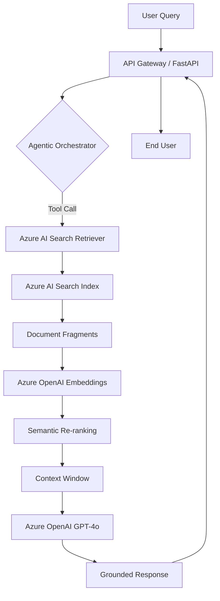

# Enterprise-GenAI-Orchestrator

## Overview

The Enterprise-GenAI-Orchestrator is a production-grade framework designed for deploying sophisticated Generative AI solutions within an enterprise environment. It leverages **Azure OpenAI**, **Azure AI Search**, and **Agentic Workflows** (via LangChain or Semantic Kernel) to deliver scalable, secure, and highly capable AI agents and Retrieval-Augmented Generation (RAG) pipelines.

### Key Features
- **Scalable RAG Pipeline:** Integration with Azure AI Search for enterprise-scale document retrieval and semantic search.
- **Agentic Reasoning:** Autonomous agents capable of multi-step tool-calling and reasoning.
- **Production-Ready API:** FastAPI-based service with comprehensive logging, validation, and monitoring.
- **Enterprise Security:** Built for Azure environment with managed identities and secure data handling.

## Architecture

The following diagram illustrates the RAG and Agentic workflow within the Azure ecosystem.

### RAG Pipeline Flow



### Component Breakdown

1.  **API Layer:** FastAPI provides a robust, high-performance interface for interacting with the GenAI engine.
2.  **Orchestrator:** Uses LangChain to manage state, memory, and tool-calling for the autonomous agent.
3.  **Retriever:** Custom implementation leveraging `azure-search-documents` to perform vector and hybrid search queries against Azure AI Search.
4.  **Embeddings:** Azure OpenAI `text-embedding-3-large` or similar for high-fidelity vector representation.
5.  **Agent Logic:** Multi-step reasoning using ReAct (Reasoning + Acting) pattern to solve complex user tasks.

## Getting Started

### Prerequisites
- Python 3.9+
- Azure Subscription
- Azure OpenAI Resource (GPT-4o and Embedding deployments)
- Azure AI Search Service

### Installation
1.  Clone the repository:
    ```bash
    git clone https://github.com/your-org/Enterprise-GenAI-Orchestrator.git
    cd Enterprise-GenAI-Orchestrator
    ```
2.  Install dependencies:
    ```bash
    pip install -r requirements.txt
    ```
3.  Configure Environment:
    Create a `.env` file from the provided template:
    ```env
    AZURE_OPENAI_ENDPOINT=https://your-resource.openai.azure.com/
    AZURE_OPENAI_API_KEY=your-key
    AZURE_SEARCH_ENDPOINT=https://your-search-service.search.windows.net
    AZURE_SEARCH_KEY=your-search-key
    AZURE_SEARCH_INDEX_NAME=your-index
    ```

## Testing
Run the pytest suite to validate the RAG and Agent logic:
```bash
pytest tests/
```

## License
Proprietary - Developed for Enterprise use.
